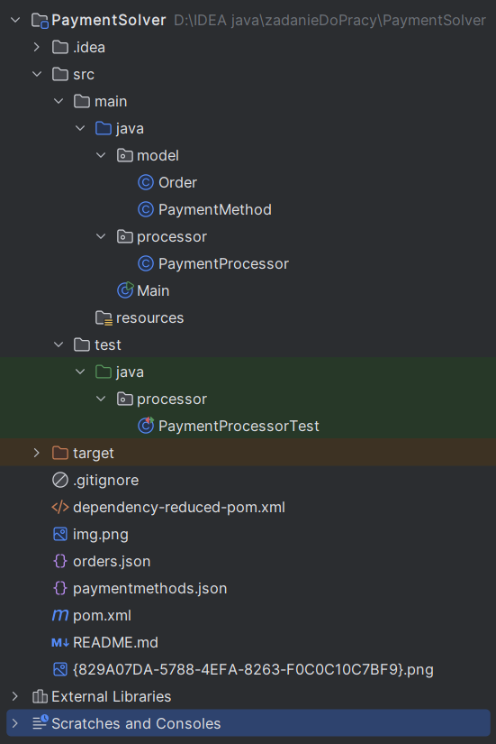

# Payment Optimizer

## Description
A Java-based tool for optimizing payment strategies for e-commerce orders. 
It calculates the most cost-effective way to pay for each order using a combination 
of loyalty points and various payment methods (e.g., promotional cards), subject to 
available limits and discounts.

## Features
- Full or partial payment with loyalty points ("PUNKTY")
- Discounted payments using promotional cards
- Partial payments combining points + cards
- Fallback to full card payments when necessary
- Unit-tested with full logic branch coverage

## Project Structure


## Requirements
- Java 21
- Maven 3.8+

## Building the Project
```bash
mvn clean package
```

## Running project
```bash
java -jar target/payment-optimizer-1.0-SNAPSHOT.jar orders.json paymentmethods.json
```


## Running Tests
```bash
mvn test
```
Or with coverage
```bash
mvn clean verify
```


## Viewing Coverage Report
target/site/jacoco/index.html

